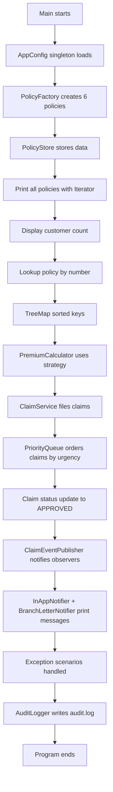

# HDFC Life Policy Claims Console

A beginner-friendly Java console application that simulates a policy claims workflow for HDFC Life. The project demonstrates plain Java collections, factory creation, strategy-based premium calculation, builder-based claim creation, observer notifications, exception handling, and audit logging.

## Project purpose

This application does the following:

- creates and stores insurance policies
- calculates premium using policy type-based strategies
- stores customer names and policy lookup data in collections
- files claims by urgency using a priority queue
- notifies observers when a claim status changes
- catches invalid policy, claim, and factory scenarios
- logs one summary line into an audit file

---

## App flow in simple words

When the program starts, it does this in order:

1. Loads the configuration through the AppConfig enum singleton.
2. Creates six sample policies using PolicyFactory.
3. Stores those policies in PolicyStore.
4. Prints all policies using an Iterator.
5. Finds the policy by number and prints customer details.
6. Shows the TreeMap sorted by policy number.
7. Calculates the ULIP premium using PremiumCalculator and UlipPremiumStrategy.
8. Files three claims with different urgency levels.
9. Changes the HIGH claim status to APPROVED.
10. Notifies both observers.
11. Polls the claims queue by urgency order.
12. Demonstrates three exception cases.
13. Writes one audit message into audit.log.

---

## Background flow of the application



---

## How each component works

### 1. Configuration

AppConfig is an enum singleton with:

- companyName = HDFC Life
- maxClaimAmount = 500000

This ensures a single shared configuration object across the app.

### 2. Policy creation

PolicyFactory creates the correct object based on the policy type:

- TERM -> TermLifePolicy
- ULIP -> UlipPolicy
- ENDOWMENT -> EndowmentPolicy

If a type is invalid, it throws UnknownPolicyTypeException.

### 3. Policy storage

PolicyStore keeps all policy data in Java collections:

- ArrayList: stores all policies
- HashSet: keeps unique customer names
- HashMap: finds policy by policy number
- TreeMap: keeps sorted policy numbers

This lets the app quickly search, count, and print the policies.

### 4. Premium calculation

Premium calculation uses the strategy pattern:

- TermPremiumStrategy: basePremium * 100 / 100
- UlipPremiumStrategy: basePremium * 112 / 100
- EndowmentPremiumStrategy: basePremium * 108 / 100

PremiumCalculator holds a PremiumStrategy and can switch strategies at runtime.

### 5. Claims and queue ordering

Claim is created using a fluent Builder inside the class.

Important points:

- policyNo is required
- claimAmount is required
- urgency is required
- hospitalName and remarks are optional
- initial status is SUBMITTED
- only updateStatus() can change status later

Claims are stored in a PriorityQueue so urgent claims are processed first:

- HIGH
- MEDIUM
- LOW

### 6. Observers and status notifications

When a claim status changes, ClaimEventPublisher notifies all registered observers.

Registered observers:

- InAppNotifier
- BranchLetterNotifier

Both print a message when the claim status becomes APPROVED.

### 7. Exception handling

The exception hierarchy is:

- PolicyServiceException
  - PolicyNotFoundException
  - InvalidClaimException
  - UnknownPolicyTypeException

Examples shown in the app:

- missing policy number -> PolicyNotFoundException
- claim amount too high -> InvalidClaimException
- invalid factory type -> UnknownPolicyTypeException

### 8. Audit logging

AuditLogger implements AutoCloseable and writes a summary line into audit.log using try-with-resources.

If file writing fails, the exception is wrapped in PolicyServiceException while preserving the root cause.

---

## Design principles in this project

This project is intentionally simple, but it follows the requested object-oriented ideas:

- SRP: PolicyStore, PremiumCalculator, ClaimService, and AuditLogger each have a focused responsibility.
- OCP: new premium strategies can be added without modifying PremiumCalculator.
- LSP: any PremiumStrategy implementation can replace another without breaking the calculation flow.
- ISP: ClaimObserver has a single method.
- DIP: ClaimService depends on abstractions instead of concrete classes where appropriate.

---

## Project structure

```text
HDFC Life Policy Claims/
├── src/
│   ├── Main.java
│   └── com/
│       └── hdfclife/
│           ├── config/
│           │   └── AppConfig.java
│           ├── exception/
│           │   ├── PolicyServiceException.java
│           │   ├── PolicyNotFoundException.java
│           │   ├── InvalidClaimException.java
│           │   └── UnknownPolicyTypeException.java
│           ├── factory/
│           │   └── PolicyFactory.java
│           ├── model/
│           │   ├── Policy.java
│           │   ├── TermLifePolicy.java
│           │   ├── UlipPolicy.java
│           │   ├── EndowmentPolicy.java
│           │   ├── Claim.java
│           │   └── Urgency.java
│           ├── observer/
│           │   ├── ClaimObserver.java
│           │   ├── ClaimEventPublisher.java
│           │   ├── InAppNotifier.java
│           │   └── BranchLetterNotifier.java
│           ├── service/
│           │   ├── ClaimService.java
│           │   └── AuditLogger.java
│           ├── store/
│           │   └── PolicyStore.java
│           └── strategy/
│               ├── PremiumStrategy.java
│               ├── TermPremiumStrategy.java
│               ├── UlipPremiumStrategy.java
│               ├── EndowmentPremiumStrategy.java
│               └── PremiumCalculator.java
├── README.md
├── .gitignore
└── audit.log
```

---

## How to compile and run

### Compile

```bash
cd "/Users/KARAN.K129/Projects/HDFC Life Policy Claims"
/Library/Java/JavaVirtualMachines/temurin-25.jdk/Contents/Home/bin/javac -d out $(find src -name "*.java")
```

### Run

```bash
cd "/Users/KARAN.K129/Projects/HDFC Life Policy Claims"
/Library/Java/JavaVirtualMachines/temurin-25.jdk/Contents/Home/bin/java -cp out Main
```

---

## Sample output

```text
HDFC Life
All policies:
HDFC-LIFE-1001 | Karan Kamble | TERM | 18500 | Active
HDFC-LIFE-1002 | Aakash Kulkarni | ULIP | 42000 | Active
HDFC-LIFE-1003 | Suyash Deshmukh | ENDOWMENT | 27000 | Lapsed
HDFC-LIFE-1004 | Vikram Shinde | TERM | 15200 | Active
HDFC-LIFE-1005 | Sneha Joshi | ULIP | 36000 | Active
HDFC-LIFE-1006 | Karan Kamble | ENDOWMENT | 22000 | Pending
Unique customer count: 5
Lookup HDFC-LIFE-1004 -> Vikram Shinde
TreeMap keys:
HDFC-LIFE-1001
HDFC-LIFE-1002
HDFC-LIFE-1003
HDFC-LIFE-1004
HDFC-LIFE-1005
HDFC-LIFE-1006
ULIP premium for HDFC-LIFE-1002 = 47040
InAppNotifier: Claim status for HDFC-LIFE-1001 updated to APPROVED
BranchLetterNotifier: Dispatching letter for HDFC-LIFE-1001 with status APPROVED
Priority queue poll order:
HIGH
MEDIUM
LOW
Policy not found: HDFC-LIFE-9999
Claim amount exceeds maximum limit: 600000
Unknown policy type: INVALID
```

---

## Notes

- This project is intentionally hard-coded to be a demo console application.
- It is not connected to a database or external service.
- The purpose is to explain Java collections, design patterns, and object-oriented flow in a simple interview-friendly way.
- The audit.log file is created as part of the demo run and stores the latest claim event summary.

---

## Summary

This application shows how a simple insurance claim system can be built using plain Java concepts without frameworks. It combines policy storage, premium calculation, urgent claim handling, observer-based notifications, and exception logging in one clear project flow.
